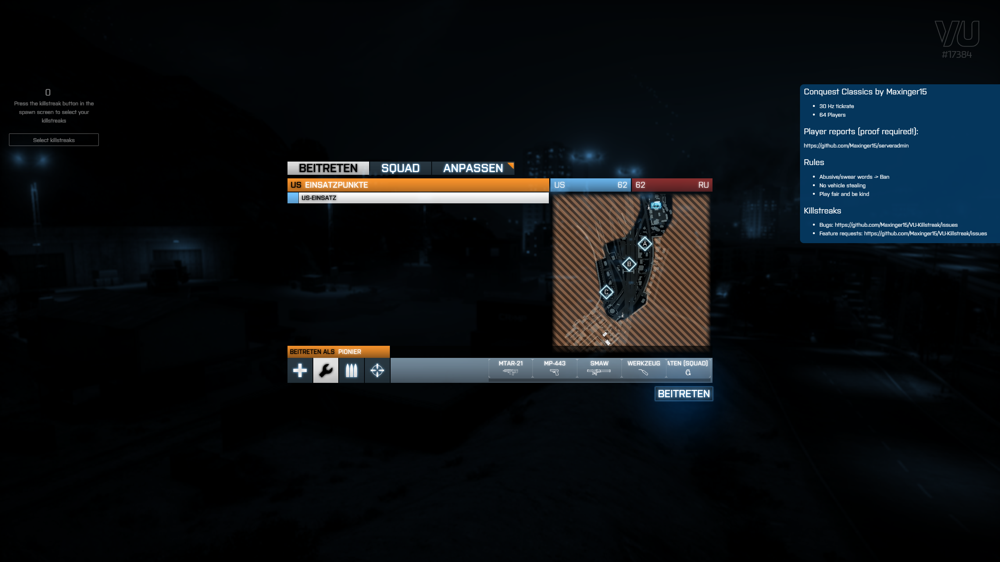

# vu-serverdescription

## Paste **your** markdown string in the ext > client > readme.lua file
Make sure that there are no blank spaces on the left of your markdown rows or the parser wouldn't display 
your markdown string correctly

If someone wants to add the ability to load the markdown from venice-rcon I would be grateful :blush:

